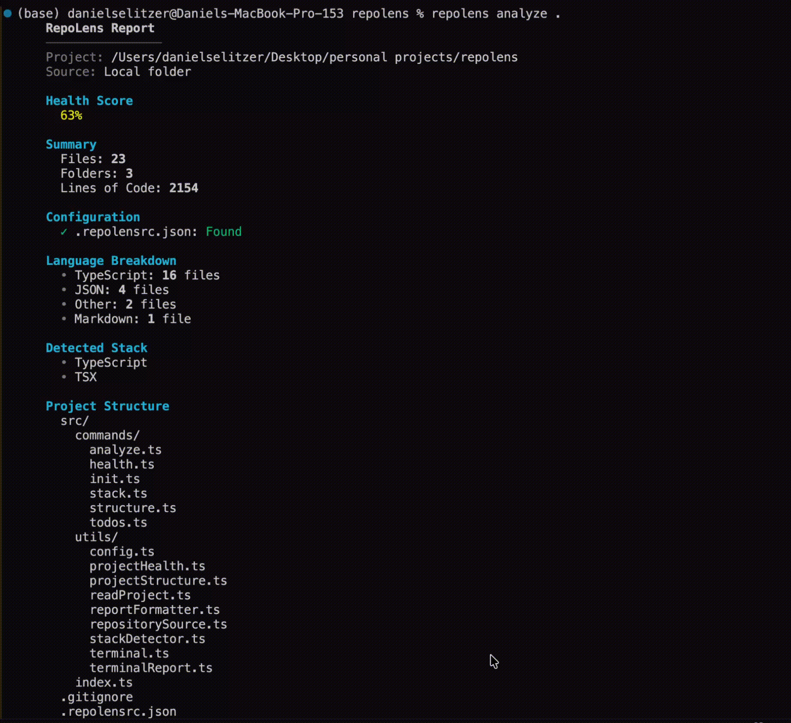

<div align="center">

# RepoLens

**Terminal-based codebase analyzer for local projects and GitHub repositories**


[Features](#features) / [Installation](#installation) / [Usage](#usage) / [Configuration](#configuration)

</div>



## Overview

**RepoLens** is a command-line developer tool that analyzes local codebases and public GitHub repositories. It generates a clean project health report directly in the terminal, with optional Markdown and JSON exports.

RepoLens helps developers quickly understand a project’s structure, tech stack, documentation quality, code quality signals, and overall repository readiness.

## Features

**Project Analysis**
- Analyze local project folders
- Analyze public GitHub repositories by URL
- Count files, folders, and total lines of code
- Generate a readable project structure tree
- Detect languages by file extension
- Detect technology stack from `package.json`

**Code Quality**
- Scan for `TODO` and `FIXME` comments
- Detect large files based on configurable line thresholds
- Calculate a simple repository health score
- Identify missing project files like `LICENSE` or `.env.example`

**Documentation & Config Checks**
- Check README quality sections
- Check `.gitignore` entries
- Check `package.json` metadata
- Support custom `.repolensrc.json` configuration
- Generate starter config with `repolens init`

**Export Options**
- Print polished terminal reports
- Export reports as Markdown
- Export reports as JSON
- Save reports to output files

## Installation

### Install from npm

```bash
npm install -g repolens
```

After installing globally, you can run RepoLens from anywhere:

```bash
repolens analyze .
```

You can also run it without installing globally:

```bash
npx repolens analyze .
```

### Install from GitHub

```bash
git clone https://github.com/selitzer/repolens.git
cd repolens
npm install
npm run build
npm link
```

After linking, you can run RepoLens from anywhere:

```bash
repolens analyze .
```

## Usage

Analyze the current project:

```bash
repolens analyze .
```

Analyze a public GitHub repository:

```bash
repolens analyze https://github.com/selitzer/repolens
```

Generate a project health report:

```bash
repolens health .
```

Show detected technologies:

```bash
repolens stack .
```

Show project structure:

```bash
repolens structure .
```

Show TODO/FIXME comments:

```bash
repolens todos .
```

Create a starter config file:

```bash
repolens init
```

Overwrite an existing config file:

```bash
repolens init --force
```

## Export Reports

Print a Markdown report:

```bash
repolens analyze . --markdown
```

Print a JSON report:

```bash
repolens analyze . --json
```

Save a Markdown report:

```bash
repolens analyze . --output report.md
```

Save a JSON report:

```bash
repolens analyze . --json --output report.json
```

## Configuration

RepoLens supports a `.repolensrc.json` file in the project root.

Create one automatically:

```bash
repolens init
```

Example configuration:

```json
{
  "largeFileThreshold": 300,
  "maxStructureDepth": 3,
  "maxEntriesPerFolder": 12,
  "ignoredDirectories": ["node_modules", ".git", "dist", "coverage"],
  "ignoredFiles": ["report.md", "report.json"]
}
```

| Option | Description |
|---|---|
| `largeFileThreshold` | Line count used to flag large files |
| `maxStructureDepth` | Maximum depth shown in the project tree |
| `maxEntriesPerFolder` | Maximum entries shown per folder |
| `ignoredDirectories` | Directories skipped during analysis |
| `ignoredFiles` | Files skipped during analysis |

## Tech Stack

<div align="center">

| Layer | Tech |
|---|---|
| Runtime | Node.js |
| Language | TypeScript |
| CLI Framework | Commander |
| Terminal Styling | Chalk |
| Repository Analysis | Node File System / Git |
| Output Formats | Terminal / Markdown / JSON |

</div>

## How GitHub Analysis Works

1. **Input** - user passes a public GitHub repository URL
2. **Clone** - RepoLens clones the repository into a temporary folder
3. **Analyze** - the same scanner used for local projects analyzes the cloned repo
4. **Report** - RepoLens prints or exports the analysis
5. **Cleanup** - the temporary clone is deleted after analysis

## License

MIT License